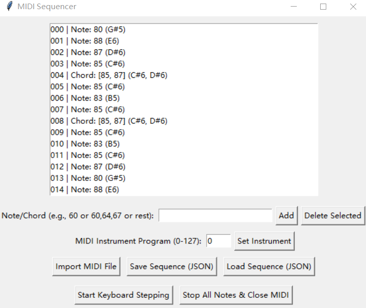

# keyboard in work
项目纯粹使用Gemini 2.5Flash，最终文件是gui4。在这个界面你可以导入midi文件，然后使用键盘弹奏你导入的音乐，注意目前只支持单乐器midi，如果需要分割单个midi文件的不同乐器，请使用
midi_tool脚本。
示例，你可以使用仙剑奇侠传的生生世世爱midi（ssssa.midi）分解后的第6轨（separated_midi\ssssa_channel6_instrument74.mid）弹奏这首歌的经典旋律。

你可以下载synthesia以及loopmidi(search the web)新建虚拟midi接口，调整synthesia的输入接口，然后弹奏喜欢的音乐。

这是一个纯粹的玩具。建议你使用venv。因为我错误的创建github repo的流程，导致我的venv被异常删除，requirement.txt也没有提前保留。该死，但是你应该可以很快处理相关依赖这个问题。

已知问题：程序退出后依然有无效的键盘输入出现在terminal上。